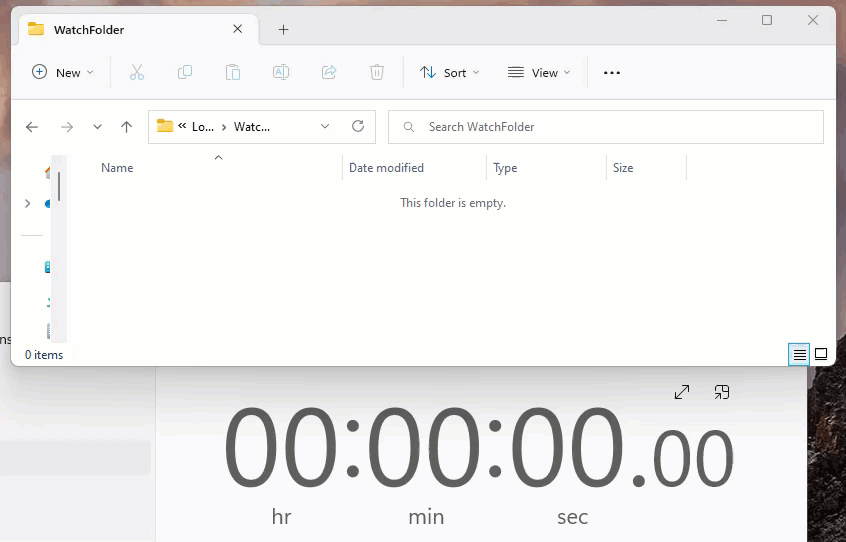

<h1 align="center">
  Windows Service - Demo
</h1>

Aplicativo de exemplo que cria um serviço do Windows para excluir novos arquivos em uma pasta

  

  

 

## 🔨 Tecnologias

Este projeto foi desenvolvido com as seguintes tecnologias:

- .NET 7
- C#
- Worker

## 🚀 Execute o projeto

1. Clone este repositório `git clone` https://github.com/dudunog/ASPNETCore7-WindowsService-Demo.git
2. Abra a solução do projeto no Visual Studio 2022 e execute-a
3. Depois basta criar algum aquivo dento da pasta `C:\WatchFolder` e esperar 1 minuto para ele ser deletado
